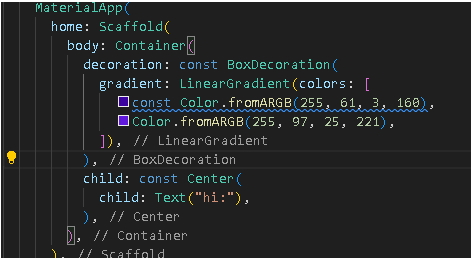

Тази част може да не я четете, но тук съм описал стъпките и подхода, който приех за подготовката на базовото уеб приложение - калкулатор. 
(Разбира се бих се радвал на критика да кажете ако съм изпуснал съществена част от основите или лоша практика която мога да премахна от сега за да нямам проблеми в бъдеще(лош навик).

Тъй като нямам опит с Flutter, съответно и Dart .
Започнах с това да видя и поиграя с програмния език Dart на framework-а Flutter , като основна идея бе да видя синтаксиса и да покрия базови термини и концепции, както и специфични за Dart неща, като :
null safety и late vars. 
Част от 'ровичкането' може да видите тук : 

https://github.com/xXxGrimReapeRxXx/DartBasics
medieval.dart

След като се почувствах сигурен в основите ( може би се дължи на факта че Dart има сходства с Javascript), реших да мина вече към самия framework Flutter.
Като за първоначална цел си поставих да разбера голямата картина, на която оперира. Разбрах за :
> import-ване на вече готови модели и стандарти, разработени от google,
> като Material App Design
 
> Eдиничната основа която е entry point на всяко приложение void main
 
> Всичко във Flutter е widget и /lib/main.dart
 
> Съответно и за widget tree , nesting widgets.
 
> Как да форматираме по такъв начин кода че да е лесно следенето и съответно да се предпазим от загуба в различните widgets ( като честно все още го намирам за малко сложно като начинаещ ):
 
> 
 
> Важността и добрата практика на keyword-а const, като главната идея е performance boost и запазването в паметта. ( high-level overview разбира се )
 
> Друго нещо което обърнах внимание без да влизам много в детайл е папковата структура която бива оформяна автоматично след като създадем проекта с flutter create <app_name> , установих че доста от папките са в зависимост на каква таргет платформа искаме приложението да работи, както и че трудът за доста от тези неща  е погрижен автоматично от Flutter, но все пак е важно да знаем кои папки можем да посочим определни зависимости или 3-rd party пакети които приложението ни използва / би могло да използва.(функционалност)
 
> Разделянето на кода в различни файлове и повикването им.
> Създаването на custom widgets.
> Разбира се не на последно място разбрах как да направим емулатор (андроид устройство) за да тестваме изготвените приложения за него.
> 

Всички тези стъпки отделно съм документирал в приложение което използвам Obsidian, защото съм напълно наясно че доброто документиране на стъпките е плюс когато се занимаваш с програмиране, отделно че е добър refferencе след време, за когато забравим нещо да си го припомним. ( въпреки че организацията и упростяването на стъпките е нещо над което искам допълнително да поработя.)

Материалите, които използвах са :
> oфициалната документация на flutter 
 
> курс в udemy : https://www.udemy.com/course/learn-flutter-dart-to-build-ios-android-apps/
 
 и 2-3 видеа от ютуб ( като гледах че малко е outdated информацията там, но за подхващане на концепции мисля че сработиха)
  
 А за ***лепило*** за различните термини и неща за които научавах използвах **ChatGPT**, за да ми каже как се свързвам взаимно.
 
 Не твърдя че успях да направя доста за седмица и няколко дни, но мога умело да потвърдя че имам базов поглед над нещата.